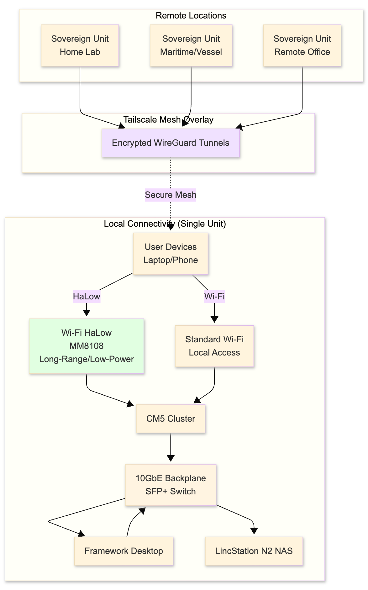

*Sovereign Personal Cloud*

This project matures a Solar-Aware Sovereign Software Architecture designed to liberate critical digital infrastructure from 'always-connected' cloud dependency. By synthesizing Talos Linux, K3s, and KEDA, we provide a reproducible blueprint for a high-performance, private, and offline-first personal common. Our 'Scale-to-Zero' orchestration ensures that resource-intensive services—including local LLMs and document automation—operate within the finite energy constraints of off-grid and mobile environments. We are not just building a server; we are engineering a resilient, 100% open-source foundation for digital autonomy and intentional connectivity

[Pitch Deck](https://docs.google.com/presentation/d/1_NWlfL6ds_Paq4qEqqiwpffoUdoYRVF_Qfd-bUAfVgY/edit?usp=sharing)

[My Blog Post](https://carlparrish.com)

🤝 How to Contribute
"We are building a Sovereign Common, and your input is vital. We welcome contributions in the following areas:

Solar Profiles: Help us define KEDA scaling triggers for different battery chemistries (LiFePO4, Na-ion, Iron Flow, etc...).

Local AI Hardening: Contribute to our validation pipelines for ensuring local LLM deterministic outputs.

Infrastructure Patterns: Share your Talos Linux or K3s configurations for specific edge-hardware clusters.

Please see CONTRIBUTING.md for our code of conduct and pull request process. Let’s build an intentional, decentralized future together."

